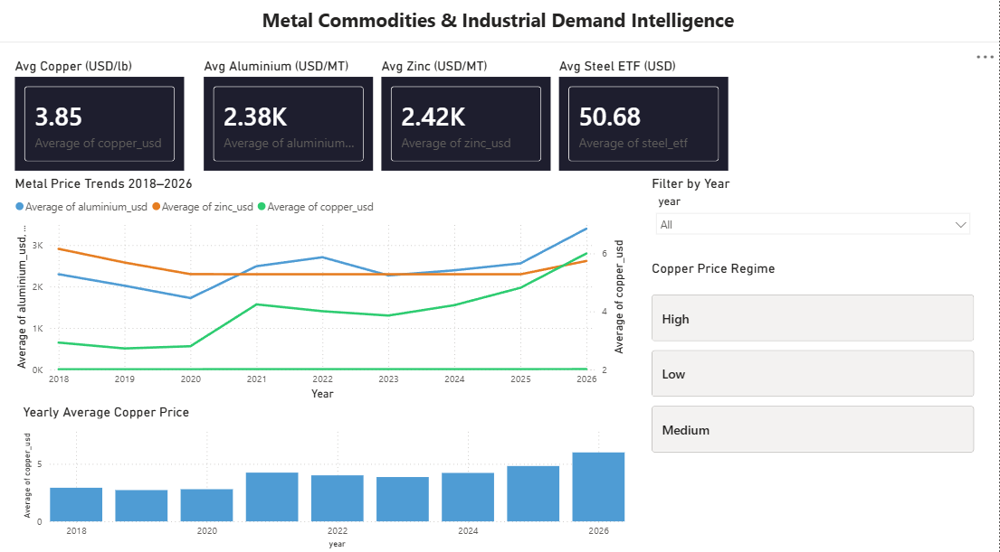
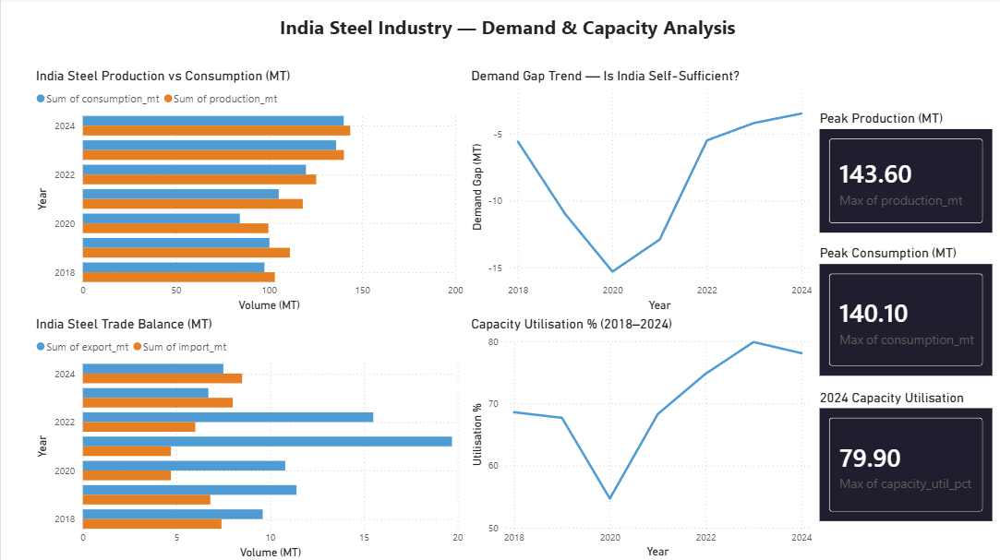

# Metal Commodities Dashboard

> End-to-end data analytics project tracking LME metal commodity prices against global macroeconomic indicators to identify price drivers and industrial demand patterns.

**Tech Stack:** Python | MySQL | Power BI | FRED API | yfinance

---

## Project Overview

Built a full-stack data analytics pipeline collecting, storing, analysing, and visualising 103 months (Jan 2018-Jul 2026) of metal commodity prices and macroeconomic data. Domain knowledge from Metallurgical & Materials Engineering was applied to interpret findings metals are physical commodities with real production costs and macro sensitivities, not just numbers.

---

## Tech Stack

| Layer | Tools |
|-------|-------|
| Data Collection | Python, yfinance API, FRED API |
| Storage | MySQL (4 tables, foreign key relationships) |
| Analysis | Python (Pandas, NumPy, Matplotlib, Seaborn, SciPy) |
| Dashboard | Power BI (3-page interactive dashboard) |

---

## Database Schema

| Table | Description | Rows |
|-------|-------------|------|
| date_dim | Time dimension table | 103 |
| commodity_prices | Monthly LME metal prices | 400+ |
| macro_indicators | Monthly macro indicators | 400+ |
| india_steel_annual | Annual India steel statistics | 7 |

---

## Dataset

| Source | Data | Coverage |
|--------|------|----------|
| yfinance API | Copper, Aluminium, Zinc futures, Steel ETF | Jan 2018 - Jul 2026 |
| FRED API | USD Index, Crude Oil WTI, 10Y Yield, Iron Ore, CPI | Jan 2018 - Jul 2026 |
| Ministry of Steel | India production, consumption, trade, capacity | 2018 - 2024 |

---

## Key Findings

| Metal | Macro Indicator | Pearson r | Strength | Interpretation |
|-------|----------------|-----------|----------|----------------|
| Copper | CPI | +0.813 | Strong | Copper is a leading inflation indicator "Dr. Copper" |
| Aluminium | Crude Oil | +0.707 | Strong | Energy cost linkage smelting consumes ~14 MWh/tonne |
| Zinc | USD Index | -0.580 | Moderate | Strong USD makes zinc expensive for non-USD buyers |
| Copper | Crude Oil | +0.541 | Moderate | Energy and demand cycle correlation |
| Zinc | CPI | -0.530 | Moderate | Zinc demand falls during inflationary tightening |

---

## Dashboard Pages

### Page 1 - Market Overview
- 4 KPI cards: avg copper, aluminium, zinc, steel ETF prices
- Multi-line price trend chart (2018-2026) with dual Y-axis
- Yearly average copper price bar chart
- Dynamic slicers: year filter and copper price regime (High/Medium/Low)

### Page 2 - Macro Correlation Explorer
- Full 9-pair Pearson correlation summary table
- 3 scatter plots: Copper vs CPI, Aluminium vs Crude Oil, Zinc vs USD Index
- Domain insight annotations explaining the physical mechanism behind each correlation

### Page 3 - India Steel Intelligence
- Production vs consumption clustered bar chart (2018–2024)
- Demand gap trend net importer vs exporter analysis
- Trade balance: exports vs imports by year
- Capacity utilisation trend (66.7% in 2020 to 79.9% in 2024)
- KPI cards: peak production 143.6 MT, peak consumption 140.1 MT

---

## Dashboard Screenshots

### Page 1 - Market Overview


### Page 2 - Macro Correlation Explorer


### Page 3 - India Steel Intelligence


---

## Analysis Charts

### Metal Price Trends


### Correlation Heatmap


### Copper vs USD Index


### Aluminium vs Crude Oil


### 12-Month Rolling Volatility


---

## Domain Insight

This project sits at the intersection of materials engineering and data analytics:

- **Aluminium:** Smelting consumes ~14 MWh per tonne. Rising crude oil raises electricity costs, pushing aluminium prices higher confirmed by r = +0.707 with crude oil over 2018-2026.
- **Copper:** r = +0.813 with CPI confirms its macroeconomic role as a leading indicator of industrial activity and inflation known as "Dr. Copper" among economists and commodity traders.
- **Zinc:** r = -0.580 with USD Index reflects its globally traded nature a stronger dollar makes zinc more expensive for non-USD buyers, reducing demand and price.

---

## Project Structure

```
metal-commodities-dashboard/
│
├── metal_dashboard.ipynb
│
├── data/
│   ├── powerbi/
│   │   ├── main_analysis.csv
│   │   ├── india_steel.csv
│   │   └── correlations.csv
│   └── charts/
│       ├── 01_metal_price_trends.png
│       ├── 02_correlation_heatmap.png
│       ├── 03_copper_vs_usd.png
│       ├── 04_aluminium_vs_crude.png
│       └── 05_rolling_volatility.png
│
├── dashboard_page1_overview.png
├── dashboard_page2_correlation.png
└── dashboard_page3_india_steel.png
```

---

## Author

**Khushboo Vats**
B.Tech Metallurgical & Materials Engineering — VNIT Nagpur (2023–2027)

[LinkedIn](https://www.linkedin.com/in/khushboo-vats-593882249/) | [GitHub](https://github.com/Vats2025)
